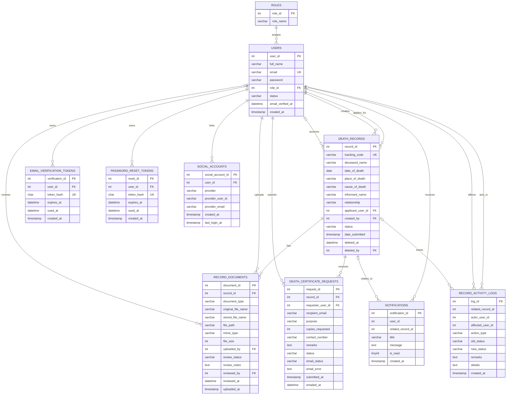

# Memento Vitae Database Design

This version is aligned with the 6DWEB Course Output PDF requirement for **Documentation Requirement, item 7: Database Design** and stops **before** the page 6 section titled **"Essentials for Information Management (6IMAN) Documentation."**

Included here:

- ERD
- Tables + fields summary

Not included here on purpose:

- business rules list
- CRUD matrix
- user roles and data access matrix
- normalization notes

## ERD

## Tables And Fields Summary

### `roles`

| Field | Type | Key | Description |
| --- | --- | --- | --- |
| `role_id` | `int(11)` | PK | Unique role ID. |
| `role_name` | `varchar(50)` | - | Role name such as Admin, Barangay Staff, or User. |

### `users`

| Field | Type | Key | Description |
| --- | --- | --- | --- |
| `user_id` | `int(11)` | PK | Unique user ID. |
| `full_name` | `varchar(100)` | - | Full name of the account owner. |
| `email` | `varchar(120)` | UK | User email address. |
| `password` | `varchar(255)` | - | Hashed password. |
| `role_id` | `int(11)` | FK | Links the user to a role. |
| `status` | `varchar(20)` | - | Account status. |
| `email_verified_at` | `datetime` | - | Date and time the email was verified. |
| `created_at` | `timestamp` | - | Account creation date and time. |

### `death_records`

| Field | Type | Key | Description |
| --- | --- | --- | --- |
| `record_id` | `int(11)` | PK | Unique death record ID. |
| `tracking_code` | `varchar(20)` | UK | Generated public reference code. |
| `deceased_name` | `varchar(150)` | - | Name of the deceased. |
| `date_of_death` | `date` | - | Date of death. |
| `place_of_death` | `varchar(150)` | - | Place where death occurred. |
| `cause_of_death` | `varchar(200)` | - | Cause of death. |
| `informant_name` | `varchar(150)` | - | Name of the informant. |
| `relationship` | `varchar(50)` | - | Informant's relationship to the deceased. |
| `applicant_user_id` | `int(11)` | FK | User assigned as applicant. |
| `created_by` | `int(11)` | FK | Staff/admin who created the record. |
| `status` | `varchar(30)` | - | Workflow status of the record. |
| `date_submitted` | `timestamp` | - | Submission timestamp. |
| `deleted_at` | `datetime` | - | Soft-delete timestamp for archived records. |
| `deleted_by` | `int(11)` | FK | User who archived the record. |

### `record_documents`

| Field | Type | Key | Description |
| --- | --- | --- | --- |
| `document_id` | `int(11)` | PK | Unique document ID. |
| `record_id` | `int(11)` | FK | Linked death record. |
| `document_type` | `varchar(80)` | - | Type of uploaded document. |
| `original_file_name` | `varchar(255)` | - | Original upload filename. |
| `stored_file_name` | `varchar(255)` | - | Saved filename on the server. |
| `file_path` | `varchar(255)` | - | File storage path. |
| `mime_type` | `varchar(120)` | - | MIME type of the file. |
| `file_size` | `int(11)` | - | File size in bytes. |
| `uploaded_by` | `int(11)` | FK | User who uploaded the document. |
| `review_status` | `varchar(30)` | - | Review result for the document. |
| `review_notes` | `text` | - | Reviewer comments or replacement notes. |
| `reviewed_by` | `int(11)` | FK | Staff/admin who reviewed the file. |
| `reviewed_at` | `datetime` | - | Review timestamp. |
| `uploaded_at` | `timestamp` | - | Upload timestamp. |

### `death_certificate_requests`

| Field | Type | Key | Description |
| --- | --- | --- | --- |
| `request_id` | `int(11)` | PK | Unique request ID. |
| `record_id` | `int(11)` | FK | Approved death record being requested. |
| `requester_user_id` | `int(11)` | FK | User who submitted the request. |
| `recipient_email` | `varchar(190)` | - | Registry office email recipient. |
| `purpose` | `varchar(150)` | - | Purpose of the request. |
| `copies_requested` | `int(11)` | - | Number of certificate copies requested. |
| `contact_number` | `varchar(40)` | - | Contact number of the requester. |
| `remarks` | `text` | - | Additional notes for the request. |
| `status` | `varchar(30)` | - | Current request status. |
| `email_status` | `varchar(30)` | - | Email delivery status. |
| `email_error` | `text` | - | Email error details if sending fails. |
| `submitted_at` | `timestamp` | - | Request submission timestamp. |
| `emailed_at` | `datetime` | - | Timestamp when email was sent. |

### `email_verification_tokens`

| Field | Type | Key | Description |
| --- | --- | --- | --- |
| `verification_id` | `int(11)` | PK | Unique verification token ID. |
| `user_id` | `int(11)` | FK | Linked user. |
| `token_hash` | `char(64)` | UK | Hashed email verification token. |
| `expires_at` | `datetime` | - | Token expiration date and time. |
| `used_at` | `datetime` | - | Timestamp when the token was used. |
| `created_at` | `timestamp` | - | Token creation timestamp. |

### `password_reset_tokens`

| Field | Type | Key | Description |
| --- | --- | --- | --- |
| `reset_id` | `int(11)` | PK | Unique reset token ID. |
| `user_id` | `int(11)` | FK | Linked user. |
| `token_hash` | `char(64)` | UK | Hashed password reset token. |
| `expires_at` | `datetime` | - | Token expiration date and time. |
| `used_at` | `datetime` | - | Timestamp when the token was used. |
| `created_at` | `timestamp` | - | Token creation timestamp. |

### `social_accounts`

| Field | Type | Key | Description |
| --- | --- | --- | --- |
| `social_account_id` | `int(11)` | PK | Unique social account link ID. |
| `user_id` | `int(11)` | FK | Linked local user account. |
| `provider` | `varchar(30)` | UK composite | Social login provider name. |
| `provider_user_id` | `varchar(191)` | UK composite | Provider-side account ID. |
| `provider_email` | `varchar(191)` | - | Email returned by the social provider. |
| `created_at` | `timestamp` | - | Link creation timestamp. |
| `last_login_at` | `timestamp` | - | Last provider login timestamp. |

### `notifications`

| Field | Type | Key | Description |
| --- | --- | --- | --- |
| `notification_id` | `int(11)` | PK | Unique notification ID. |
| `user_id` | `int(11)` | Reference | Recipient user. |
| `related_record_id` | `int(11)` | Reference | Related death record, if any. |
| `title` | `varchar(150)` | - | Notification title. |
| `message` | `text` | - | Notification body. |
| `is_read` | `tinyint(1)` | - | Read flag. |
| `created_at` | `timestamp` | - | Creation timestamp. |

### `record_activity_logs`

| Field | Type | Key | Description |
| --- | --- | --- | --- |
| `log_id` | `int(11)` | PK | Unique activity log ID. |
| `related_record_id` | `int(11)` | Reference | Linked death record. |
| `actor_user_id` | `int(11)` | Reference | User who performed the action. |
| `affected_user_id` | `int(11)` | Reference | User affected by the action. |
| `action_type` | `varchar(50)` | - | Type of logged action. |
| `old_status` | `varchar(30)` | - | Previous record status. |
| `new_status` | `varchar(30)` | - | New record status. |
| `remarks` | `text` | - | Additional note for the activity. |
| `details` | `text` | - | Description of the action performed. |
| `created_at` | `timestamp` | - | Log creation timestamp. |

## Note For Submission

If your instructor wants the documentation to follow the 6DWEB PDF only up to the point before 6IMAN, this is the safer file to place in the documentation under **Database Design**.
