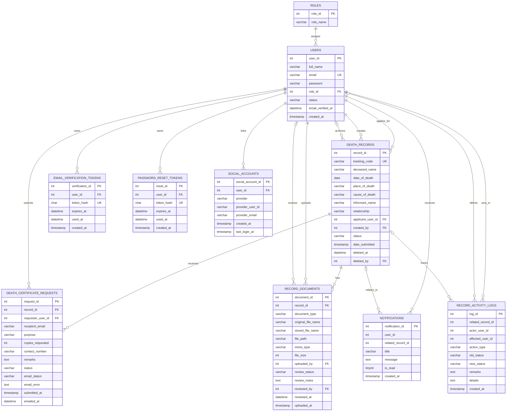

# Memento Vitae ERD

This ERD was derived from [`mementovitae.sql`](C:/Users/Zen/Downloads/Memento_Vitae/mementovitae.sql) and cross-checked against the PHP workflow in [`includes/db.php`](C:/Users/Zen/Downloads/Memento_Vitae/includes/db.php).

## Mermaid ERD

## Relationship Notes

- Physical foreign keys exist for `users.role_id`, all token tables, `social_accounts.user_id`, `death_records.applicant_user_id`, `death_records.created_by`, `death_records.deleted_by`, `record_documents.record_id`, `record_documents.uploaded_by`, `record_documents.reviewed_by`, `death_certificate_requests.record_id`, and `death_certificate_requests.requester_user_id`.
- `notifications.user_id`, `notifications.related_record_id`, `record_activity_logs.related_record_id`, `record_activity_logs.actor_user_id`, and `record_activity_logs.affected_user_id` are used as references in the application, but the SQL dump does not enforce them with foreign key constraints.
- `death_records.deleted_at` and `death_records.deleted_by` implement soft delete and restore behavior rather than permanently removing records.

## Controlled Values Used By The App

- `roles.role_name`: `Admin`, `Barangay Staff`, `User`
- `death_records.status`: `Pending`, `Verified`, `Approved`, `Rejected`
- `record_documents.document_type`: `Medical Certificate`, `Autopsy Report`, `Valid ID`, `Supporting Affidavit`
- `record_documents.review_status`: `Pending Review`, `Valid`, `Needs Replacement`, `Rejected`
- `death_certificate_requests.status`: currently created as `Submitted`
- `death_certificate_requests.email_status`: `Pending`, `Sent`, `Failed`
- `users.status`: observed as `active` in registration, admin creation, social sign-in, and email verification flows

## Workflow Summary

- A `User` submits or is assigned a `death_record`.
- Staff or admins manage the `death_record` lifecycle.
- The applicant uploads `record_documents`.
- Staff review documents before a record can move to `Verified`.
- Only `Approved` records can generate `death_certificate_requests`.
- User-facing alerts are stored in `notifications`.
- Auditing and workflow history are stored in `record_activity_logs`.
